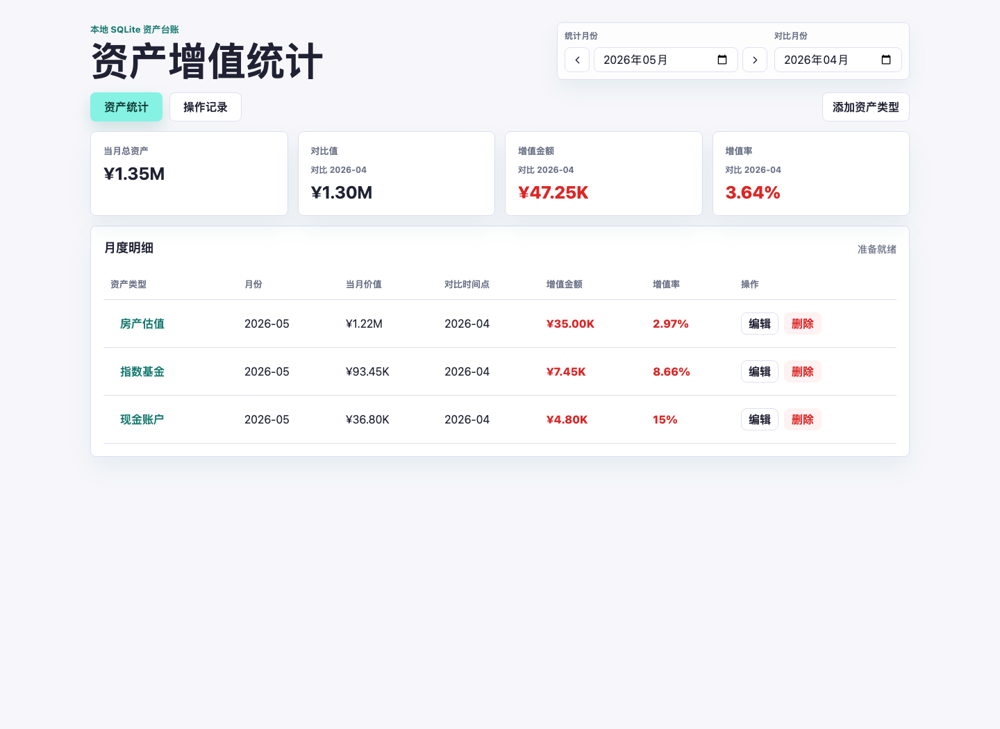

# assets-accretion

本地资产增值统计工具。后端使用 Bun + TypeScript + Hono，数据写入本地
SQLite 文件；前端使用 React 提供图形化录入和展示。



## 功能

- 添加资产类型，例如现金、股票、基金、房产。
- 每个资产类型只创建一次，按月份持续更新该类型的资产价值。
- 每个月的明细都会显示所有资产类型，未填写当月价值的类型显示为待记录。
- 月度明细支持编辑和删除；删除需要二次确认。
- 操作记录页面可查询每次创建、更新、删除和恢复动作，删除记录支持恢复。
- 点击资产类型可在抽屉中查看月维度变化和折线趋势。
- 自动查找同资产类型的上一个记录月份，计算增值金额和增值率。
- 支持选择任意对比月份，增值金额和增值率会明确标记对比时间点。
- 汇总指定月份的总资产、前期对比值、总增值金额和总增值率。
- 金额展示超过 1000 时自动使用 K/M/B 缩写，避免表格和图表被长金额撑开。

## 开发

```bash
bun install
bun run dev
```

项目通过 `.npmrc` 和 `bunfig.toml` 固定使用 npm 官方源
`https://registry.npmjs.org/` 安装依赖。

默认访问地址是 <http://localhost:3000>。

SQLite 默认文件位于 `data/assets.sqlite`，已加入 `.gitignore`。

业务时间统一采用东八区（GMT+8），包括本地 SQLite 中的创建、更新、恢复时间以及前端默认月份。

## 数据迁移

迁移或备份数据前，先停止正在运行的本地服务，避免复制到写入中的 SQLite 文件。

默认数据文件以 `data/assets.sqlite` 为前缀，复制时包含主库、WAL 和 SHM 文件：

```bash
cp data/assets.sqlite* /你的备份目录/
```

恢复时同样先停止服务，再把这些文件放回 `data/` 目录。

如果启动服务时指定了自定义数据库路径，例如：

```bash
ASSETS_DB_PATH=/some/path/my-assets.sqlite bun run dev
```

则迁移同名前缀的一组文件：

```bash
cp /some/path/my-assets.sqlite* /你的备份目录/
```

资产类型、月度记录、操作记录和删除恢复快照都在同一个 SQLite 数据库内，不需要额外迁移其他 db 文件。`.omx/`、`node_modules/` 和 `data/*.sqlite*` 都不应提交到 git。

## 架构概览

- `src/client/components/ui/`：shadcn/ui 风格基础组件。
- `src/client/components/dashboard/`：资产台账业务组件。
- `src/client/api/`、`src/client/hooks/`、`src/client/styles.css`：分别承载前端请求、页面状态和样式。
- `src/server/api/`：Hono API 路由；每个接口独立文件，资源目录 `index.ts` 只做组装。
- `src/server/db/`：SQLite schema、查询和增值计算。

## 项目文档

- `AGENTS.md`：Agent 执行入口和仓库规则。
- `CLAUDE.md`：指向 `AGENTS.md` 的软链，避免并行维护两份规则。
- `docs/README.md`：规则库和知识库索引。
- `docs/rules/development-guide.md`：开发、架构边界、验证与提交要求。
- `docs/knowledge-base/project-overview.md`：技术栈、目录结构、数据模型和 API 说明。
- `docs/experience.md`：开发经验、踩坑背景、用户偏好和后续维护提醒。

## API

- `GET /api/health`
- `GET /api/asset-types`
- `POST /api/asset-types`
- `PUT /api/asset-types/:id`
- `GET /api/asset-types/:id/history`
- `GET /api/records?month=YYYY-MM`
- `POST /api/records`
- `PUT /api/records/:id`
- `DELETE /api/records/:id`
- `GET /api/operation-logs?action=record_deleted&limit=100`
- `POST /api/operation-logs/:id/restore`
- `GET /api/summary?month=YYYY-MM`
